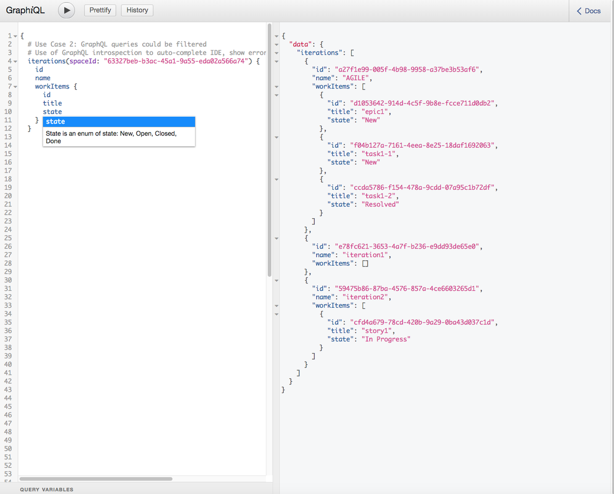
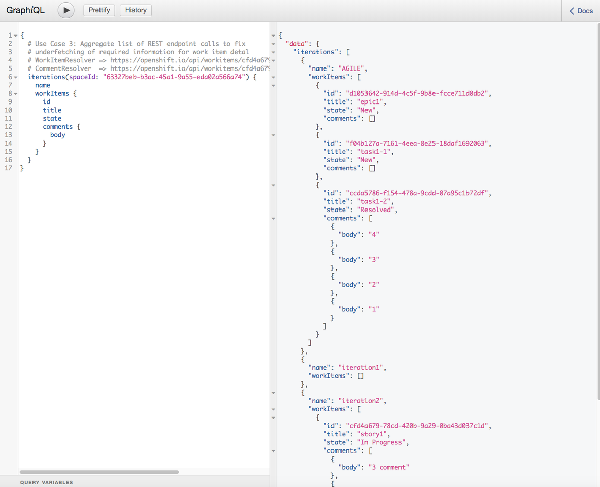
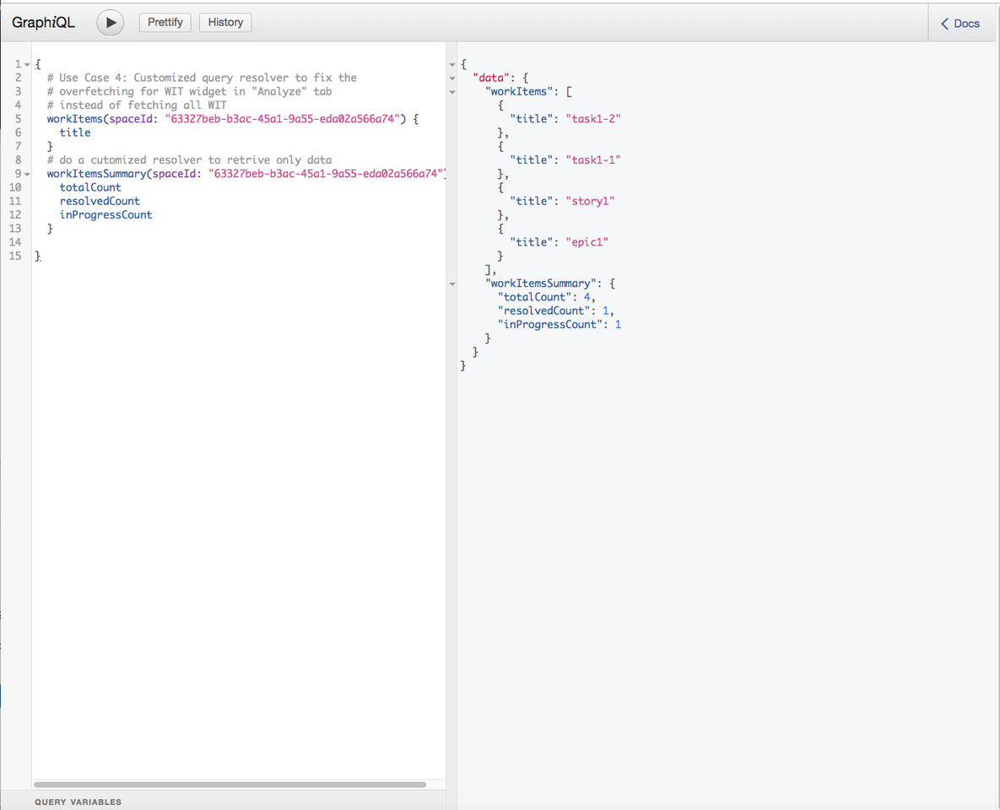
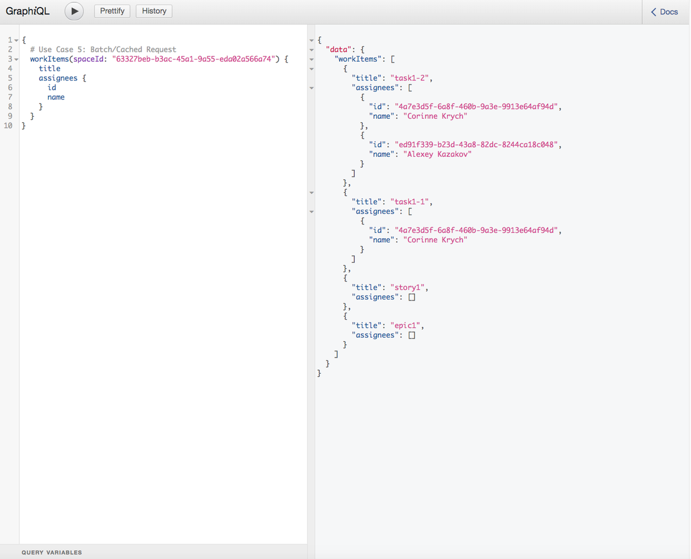

The POC is run against production [OSIO](https://openshift.io) REST endpoints.

### Use Case 1: Single endpoint
Use a single endpoint to query multiple REST services
We want to load some data from different backend services.
For example from WIT (some information about a space) + Auth (space collaborators).

__TODO__ add auth client.

### Use Case 2: Query DSL
In Planner there is a need for a query language for the OSiO end-user.
With GraphQL a standard DSL can be used by a user. For the purpose of the PoC, we use GraphiQL component which provide auto completion.
For ex, if we search the list of work items associated to an iteration for a given space:

Query:
```
{
  # Use Case 2: GraphQL queries could be filtered
  # Use of GraphQL introspection to auto-complete IDE, show errors
  iterations(spaceId: "63327beb-b3ac-45a1-9a55-eda02a566a74") {
    id
    name
    workItems {
      id
      title
      state
    }
  }
}
```



### Use Case 3: Aggregate list of REST endpoint calls to fix underfetching.
One among several similar ex, in Planner when we want to display the work item detail, we need to call the list of comments associated to this wit, the list of events, links. GraphQL solution to underfetching is to define a nested query and then request the data in one fetch.

Query:
```
{
  # Use Case 3: Aggregate list of REST endpoint calls to fix
  # underfetching of required information for work item detal
	# WorkItemResolver => https://openshift.io/api/workitems/cfd4a679-78cd-420b-9a29-0ba43d037c1d
  # CommentResolver  => https://openshift.io/api/workitems/cfd4a679-78cd-420b-9a29-0ba43d037c1d/comment
  iterations(spaceId: "63327beb-b3ac-45a1-9a55-eda02a566a74") {
    name
    workItems {
      id
      title
      state
      comments {
        body
      }
    }
  }
}
```



### Use Case 4: Customized query resolver to fix the overfetching
For ex, in the "Analyze" tab we have a WIT widget which fetches all the work items for a given space even tho it only display the total number versus the number of in progress and resolved wit. With GraphQL, the UI developer can implement a custom Resolver which return a lighter payload with only those 3 numbers.

Query:
```
{
  # Use Case 4: Customized query resolver to fix the
  # overfetching for WIT widget in "Analyze" tab
  # instead of fetching all WIT
  workItems(spaceId: "63327beb-b3ac-45a1-9a55-eda02a566a74") {
    title
  }

  workItemsSummary(spaceId: "63327beb-b3ac-45a1-9a55-eda02a566a74") {
    totalCount
    resolvedCount
    inProgressCount
  }
}
```



### Use Case 5: Batch/Cached Request
In GraphQL each field is fetched via a resolver. If you’re not careful, you can end up with sending multiple round trips to the service over the course of a single GraphQL query. This is known as the n+1 problem.
For ex, I want to retrieve a list of work items with the assignees. One user can be assigned to several work items. With GraphQL DataLoader, we can use cached function (memoized function) for the scope of a query. Therefore the REST endpoint to retrieve assignee details is call only once even if the same user is assigned twice.
You can also use DataLoader to batch the query of several user together.

Query:
```
{
  # Use Case 5: Batch/Cached Request
  workItems(spaceId: "63327beb-b3ac-45a1-9a55-eda02a566a74") {
    title
    assignees {
      id
      name
    }
  }
}
```



### Use Case 6: Subscription
This is a need in several places. With the use of a store (ngrx) or with different UI caching mechanism, we’ve improved UI caching but we’ve still need refresh the user cache. In fabric8-ui we use UI navigation to fetch new data.
__TODO__ use
